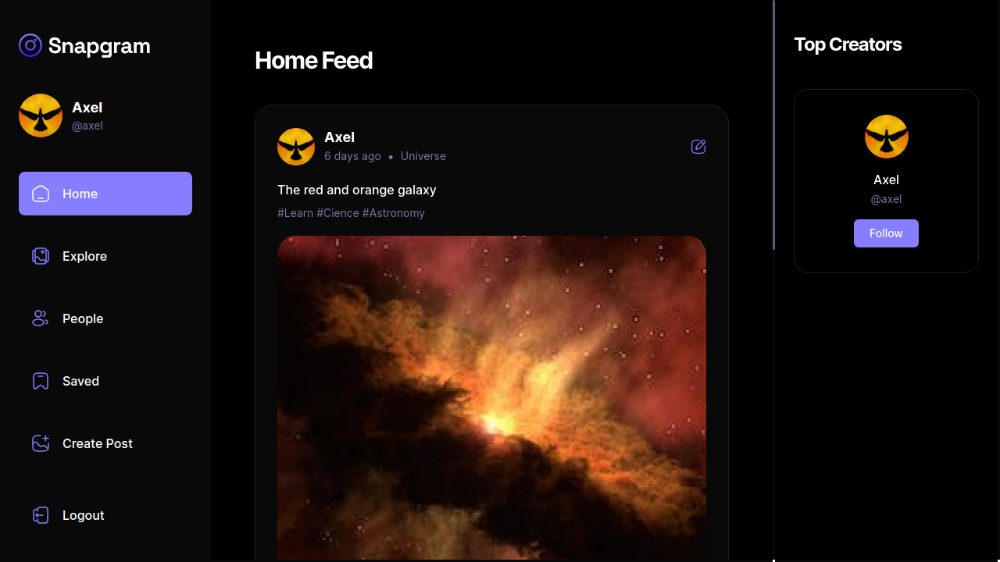
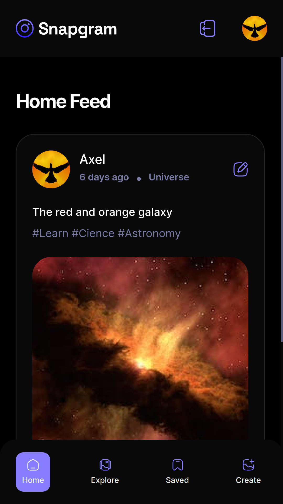

# Snapgram

## Descripción

Código base de la aplicación web Snapgram Hecha en React.js, React Dropzone, React Hooks Form, React Icons, React Intersection Observer, React Query, React Router Dom, Shadcn/ui, Sweetalert2, TypeScript, Zod, Tailwind CSS que utiliza Appwrite como backend as a service.

---

## Configuración de shadcn

### Modificación del archivo tsconfig.json

```js
{
  "compilerOptions": {
    /* Shadcn */
    "baseUrl": ".",
    "paths": {
      "@/*": [
        "./src/*"
      ]
    }
  },
}
```

### Actualizar el archivo vite.config.ts

```bash
npm i -D @types/node
```

```ts
import path from "path";
import react from "@vitejs/plugin-react";
import { defineConfig } from "vite";

export default defineConfig({
  plugins: [react()],
  resolve: {
    alias: {
      "@": path.resolve(__dirname, "./src"),
    },
  },
});
```

### Ejecutar el comando shadcn-ui init

```bash
npx shadcn-ui@latest init
```

### Configurar los components.json

```bash
- ✔ Would you like to use TypeScript (recommended)? … no / yes
- ✔ Which style would you like to use? › Default
- ✔ Which color would you like to use as base color? › Slate
- ✔ Where is your global CSS file? … src/styles/index.css
- ✔ Would you like to use CSS variables for colors? … no / yes
- ✔ Where is your tailwind.config.js located? … tailwind.config.js
- ✔ Configure the import alias for components: … @/components
- ✔ Configure the import alias for utils: … @/lib/utils
- ✔ Are you using React Server Components? … no / yes
- ✔ Write configuration to components.json. Proceed? … yes
```

### Agregar componentes al proyecto

```bash
npx shadcn-ui@latest add button
npx shadcn-ui@latest add form
npx shadcn-ui@latest add input
npx shadcn-ui@latest add label
npx shadcn-ui@latest add toast
npx shadcn-ui@latest add textarea
npx shadcn-ui@latest add tabs
```

---

## Vista En Versión Desktop



## Vista En Versión Mobile



---

## Enlace A La Aplicación

- [Snapgram](https://snapgram-nu.vercel.app/)

---

## Hecho con

- [AppWrite](https://appwrite.io/) - For backend as a service
- [React](https://react.dev/) - JS library
- [React Dropzone](https://react-dropzone.js.org/) - For create a HTML5-compliant drag'n'drop zone for files.
- [React Hook Forms](https://react-hook-form.com/) - For forms with easy-to-use validation.
- [React Icons](https://react-icons.github.io/react-icons/) - For Icons
- [React Intersection Observer](https://github.com/thebuilder/react-intersection-observer#readme) - For tell you when an element enters or leaves the viewport.
- [React Query](https://tanstack.com/query/latest) - For data
- [React Router Dom](https://reactrouter.com/en/main) - For routes
- [Shadcn/ui](https://ui.shadcn.com/) - For build a custom component library for the project.
- [Sweetalert2](https://sweetalert2.github.io/) - For alerts
- [Tailwind CSS](https://tailwindcss.com/) - For styles
- [Tailwind CSS Animate](https://github.com/jamiebuilds/tailwindcss-animate) - For creating animations.
- [Typescript](https://www.typescriptlang.org/) - For Javascript with syntax for types
- [Vite](https://vitejs.dev/) - For development environment
- [Zod](https://zod.dev/) - For TypeScript-first schema validation

---

## Comandos

- npm i
- npm run dev
- npm run build

---

## Dependencias

- AppWrite
- React
- React Dropzone
- React Hook Form
- React Icons
- React Intersection Observer
- React Query
- React Router Dom
- Shadcn/ui
- Sweetalert2
- Tailwind-merge
- Zod

## Dependencias De Desarrollo

- Autoprefixer
- Post CSS
- Tailwind CSS
- Tailwind CSS Animate
- Typescript
- Vite

---

## Autor

- Website - [Axe10rellana](https://axe10rellana.github.io/portafolio/portafolio/)
